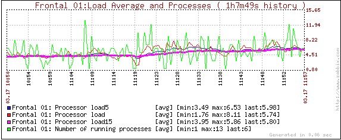

TechDay'01 : Debriefing
=======================

11h19 :
-------
J'ai activé Tokyo-Cabinet sur un frontal web (is_cool_web1)

Suivent les éléments notables (ce qui n'est pas dans ce qui suit semble donc être resté ISO)

Le load average augmente : ~4.5 -> ~5.7

Le CPU passe d'~30% à ~40%

Les écritures augmentent sur sdb -> nouveau fichier de logs

J'ai ensuite testé les différentes stratégies d'expiration de clés

11h10 :
-------
test de l'expiration fine de clés par minute 

- 20 appels au script d'expiration sur 1 minute de clés, au rythme de 1 appel par minute.
- 6-7 sec pour expirer de 3000 à 7000 clés (en bleu)

+-------+---------+----------------+
| #keys | time(s) | flushed keys/s |
+=======+=========+================+
| 6603  | 7,58    | 871,11         |
+-------+---------+----------------+
| 6247  | 6,28    | 994,75         |
+-------+---------+----------------+
| 7282  | 6,72    | 1083,63        |
+-------+---------+----------------+
| 6013  | 6,72    | 894,79         |
+-------+---------+----------------+
| 5729  | 5,63    | 1017,58        |
+-------+---------+----------------+
| 5499  | 5,88    | 935,2          |
+-------+---------+----------------+
| 3593  | 3,77    | 953,05         |
+-------+---------+----------------+
| 6285  | 6,44    | 975,93         |
+-------+---------+----------------+
| 5229  | 6,11    | 855,81         |
+-------+---------+----------------+
| 5830  | 7,53    | 774,24         |
+-------+---------+----------------+
| 4658  | 5,13    | 907,99         |
+-------+---------+----------------+
| 5364  | 6,54    | 820,18         |
+-------+---------+----------------+
| 5571  | 6,53    | 853,14         |
+-------+---------+----------------+
|       |         | 918,26         |
+-------+---------+----------------+

11h32 :
-------
test de l'expiration fine de clés par heure (clés restantes ~ 28 minutes) 

- 1 appel au script d'expiration sur l'heure complête
- 1min47 pout expirer 96900 clés (en vert) = 905,6 key/s

11h46 :
-------
test de l'expiration complète (fonction vanish)

- -1 min pour tout vider (+ 200000 clés) (en orange)
- Je reprends ce test de manière plus précise, un peu plus loin

.. image:: graph_expiration.gif

13h55 :
-------
passage à false du flag 'expirable'

- on évite un certain nombre de traitement qui permettent de gérer l'expiration fine (à la minute) des clés

...n'a rien changé

14h10 :
-------
Test en preprod (web1) du site sur le compte de berni.... pas de page blanche. D'un autre côté, il n'a pas énormément d'amis en pp

14h47 :
-------
désactivation de Tokyo Cabinet sur web1

début des passages en short track des tickets

commentaires des tickets d'Alex :

::

    #1128 : franchement tranquille
    #1910 : plus touchy : submodule symfony, mais je pense que ça se passera bien
    #1908 : petite foulé, décrassage gentillet

donc,

14h51 :
-------
*4.01.02.1*

un peu de nettoyage

::

    * 0909399 [CLEANING] Remove Tekora and mobile service references (#1908). 
    * 6c0cb43 [CDN] remove again the logo-kiwi image
    * a32eba8 [CLEANING] Remove references to common directory (#1128).

15h12 :
-------
Chronometrage précis du ``tokyoTyrant::vanish()``

::

    237385 clés sur token1
    294881 clés sur token2 (j'ai interrompu le précédent vanish... il restait des clés)

- 38.384s pour tout flusher (13868 clés flushées par seconde)

au Final pour la partie expiration des clés, on a les résultats suivants

+--------------+----------------+
| Strategy     | flushed keys/s |
+==============+================+
| Smart/minute | 918,2          |
+--------------+----------------+
| Smart/hour   | 905,6          |
+--------------+----------------+
| Vanish       | 13868          |
+--------------+----------------+

il n'y a pas vraiment photo, pour le moment.... 

15h40 : 
-------
*4.01.02.2*

Nouveau passage de tickets

::

    * a325dd1 [core] Removal of stream-enabling if clause (#1927)
    * 4597346 [CLASS] Removal of an old config var in order to avoid future bugs (#1827)

rollback, cause mauvais merge : le fbml ne passait plus. Seul le haut du site s'affichait.

Aux prises avec les merges, Antoine nous a dégoté le git mergetool... qui peut effectivement s'avérer pratique pour résoudre un conflit.... Pour ma part, je reste attaché au git wtf !!! ;)

16h05 : 
-------
*4.01.02.3*

et on repasse, avec le patch qui regle tout (avec une preprod pour rassurer Pierre)

::

    * 9678424 Bug fix from failed merge(#1927)
    | * a325dd1 [core] Removal of stream-enabling if clause (#1927)
    | * 4597346 [CLASS] Removal of an old config var in order to avoid future bugs (#1827)

16h20 :
-------
*4.01.02.4.rc1*

preprod avec le refactor memcache de Pierre. on a des problèmes sur l'affichage des grades.

16h40 :
-------
en parallèle, on commence à préparer le passage du ticket d'Antoine sur le nettoyage de profile.phtml.

restera ensuite le submodule symfony ^_^

17h20 :
-------
*4.01.02.4.rc2*

finalement, ce sera une RC avec le submodule... quel suspens... que va-t-on trouver dans la 4.01.02.4 ???

c'est OK, mais le déploiement prend 15 minutes (symfony est assez épais).... 15 minutes hors ligne, pour moi, c'est non... on va attendre les nouveaux deploiements que Vermeer nous concocte.

18h00 :
-------
*4.01.02.4-rc3*
c'est le tour d'Antoine d'avoir sa rc...

18h08 :
-------
*4.01.02.4*

Antoine a gagné cette manche

::

    * b845448 Cleaning profile template(#1928)

retour sur le ticket de Pierre

18h20 :
-------
*4.01.02.5-rc1*

Le ticket refactoring memcache + 1 bugfix sur l'admin....

bon... ca ne se passe toujours pas bien... :(

18h30...
--------

Je cloture ici le TechDay'01... pas mal de choses, mais le cycle de release normal reprend ses droits. 

go for the 4.01.03-rc1 ....

to be continued....

